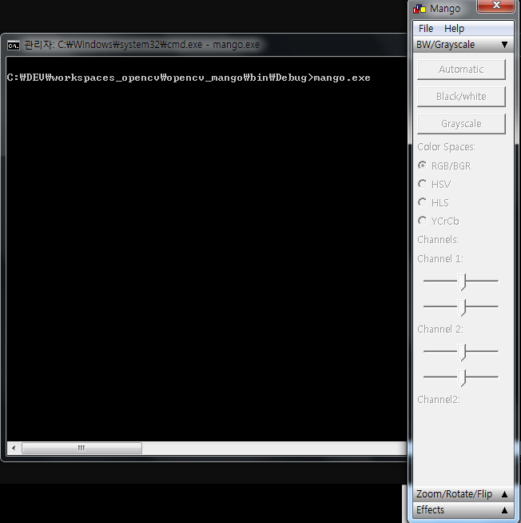
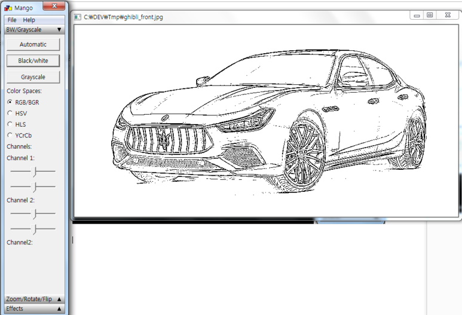

# Opencv GUI by the wxWidgets framework - mango

This is a GUI program for the image processing with opencv.
  This program is actually from the codeproject named mango, you can check the program.  
[site](https://www.codeproject.com/Articles/31664/Mango-Photo-Editor-with-OpenCV)

And with a little source code modification running on a wxwidgets 3.X and opencv 3.4.7 

Some functions(button) can not be working at this time writing. 

## screenshots

